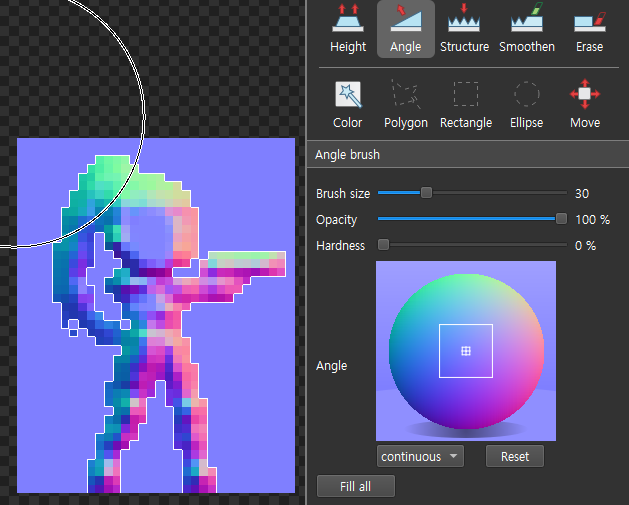
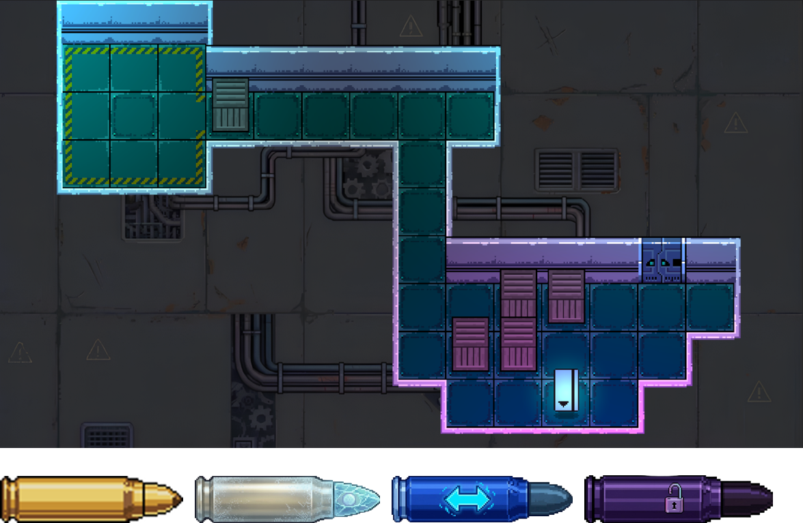
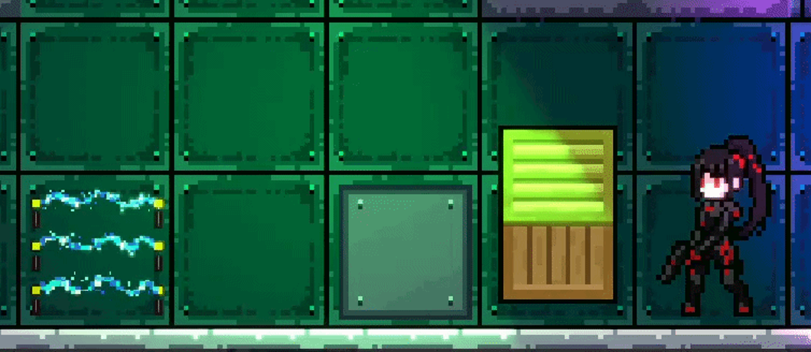
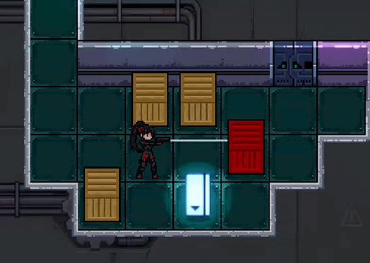

# Push & Hack

사이버펑크 컨셉의 2D 턴제 소코반 퍼즐 게임  
광운대학교 소프트웨어학부 졸업작품 (2025.12 ~ 2026.11)

> 현재 개발 진행 중입니다. 튜토리얼, 맵 추가, 애니메이션 수정, 광원 및 노멀맵 다듬기가 예정되어 있습니다.

---

## 플레이 영상

---

## 스크린샷

### 캐릭터 노멀맵 작업

### 맵

### 총알 선택 UI — 일반 탄

### 총알 선택 UI — 위치변환 탄

### 총알 선택 UI — 원격조종 탄

### 게임플레이 — 사이드뷰

### 게임플레이 — 조준 모드

### 게임플레이 — 탑뷰

---

## 게임 소개

어둡고 퇴폐적인 사이버펑크 도시를 배경으로, 플레이어는 총을 이용해 상자를 조종하며 퍼즐을 풀어나갑니다.
기존 소코반에 총알 기믹을 추가해, 총알 종류마다 상자에 다른 효과를 부여하며 전략적인 사고를 요구합니다.

---

## 총알 종류

| 총알 | 색상 | 효과 |
|------|------|------|
| 일반 탄 | 노란색 | 나무 상자를 파괴, 철제 상자에는 효과 없음 |
| 위치변환 탄 | 보라색 | 맞춘 상자와 플레이어의 위치를 교환 |
| 원격조종 탄 | 빨간색 (십자) | 맞춘 상자를 원하는 방향으로 원격 조종 |

---

## 조작키

| 키 | 동작 |
|----|------|
| 방향키 | 플레이어 이동 |
| Z | 조준 모드 진입 / 총알 발사 |
| 방향키 (조준 모드) | 조준 방향 변경 |
| A / D (조준 모드) | 총알 종류 변경 |
| X | 조준 해제 |
| Q | Undo |

---

## 주요 기술

- 턴제 Undo 시스템 — 커맨드 패턴으로 모든 행동 기록, 자유롭게 되돌리기 가능
- URP 2D 조명 — 노멀맵, 셰이더를 활용한 광원 반응 비주얼
- 픽셀아트 타일맵 — 사이버펑크 분위기에 맞춰 직접 제작
- 총알별 하이라이트 UI — 발사 전 영향 범위 시각적 표시

---

## 기술 스택

| 항목 | 내용 |
|------|------|
| 엔진 | Unity 6 (6000.3.3f1) URP |
| 언어 | C#, ShaderLab, HLSL |
| 버전 관리 | Unity Version Control (Plastic SCM) |
| AI 도구 | Gemini, GitHub Codex |

---

## 팀원 및 역할

| 이름 | 역할 |
|------|------|
| 안태우 | 총알 로직 구현, URP 2D 광원·노멀맵·셰이더, 픽셀아트 |
| 허은빈 | UI 구현, 픽셀아트, 사운드 |
| 심정환 | 픽셀아트, 맵 제작, 기본 이동, Undo 로직 구현 |

---

## 버전 관리

본 프로젝트는 Unity Version Control (Plastic SCM)을 통해 팀 협업 및 브랜치 관리를 진행했습니다.
크래프톤 정글 랩 지원을 위해 GitHub에는 최종 소스코드만 업로드되어 있으며, 개발 히스토리는 Unity Cloud에서 관리되었습니다.

브랜치 구조:

- /main/Bullet — 총알 기믹 구현
- /main/UI — UI 작업
- /main/Map — 맵 제작
- /main/Light — 조명 작업
- /main/Sound — 사운드
- /main/feature — 기능 추가
- /main/prototype — 프로토타입 테스트

---

## 실행 방법

본 프로젝트는 Unity Version Control로 관리되었으며, 크래프톤 게임 테크랩 지원을 위해 GitHub에는 최종 소스코드만 업로드되어 있습니다.
별도의 빌드 파일은 제공되지 않으며, 실제 플레이 화면은 상단 플레이 영상을 통해 확인하실 수 있습니다.

