# Push & Hack

사이버펑크 컨셉의 2D 턴제 소코반 퍼즐 게임  
광운대학교 소프트웨어학부 졸업작품 (2025.12 ~ 2026.11)

> 현재 개발 진행 중입니다. 최신 데모에는 튜토리얼 UI, 캐릭터와 오브젝트 그림자, 광원 및 노멀맵 개선 사항이 반영되어 있습니다.

---

## Windows 데모 다운로드

[Push & Hack Windows Demo — Levels 1–5](https://github.com/itsfrankocean/Push_and_Hack/releases/tag/v0.1.0-demo)

ZIP 파일 전체를 압축 해제한 뒤 `PushAndHack.exe`를 실행해 주세요. 현재 데모에는 메인 메뉴와 Level 1부터 Level 5까지 포함되어 있습니다.

---

## 최신 데모 스크린샷

### 튜토리얼 UI와 조작 안내

스테이지 안에서 조작법을 바로 확인할 수 있으며, `E` 키로 설명창을 넣고 뺄 수 있습니다.

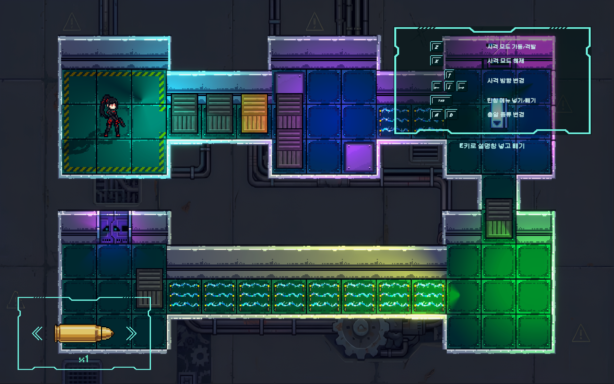

### 상자·총알 기믹 설명 UI

상자의 격파·밀기 가능 여부와 총알별 효과를 플레이 중에 확인할 수 있습니다.

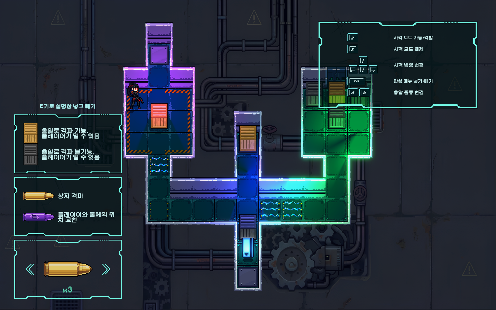

### 캐릭터 그림자와 광원 반응

캐릭터가 주변 광원의 방향과 색에 반응하도록 그림자와 노멀맵 표현을 다듬었습니다.

  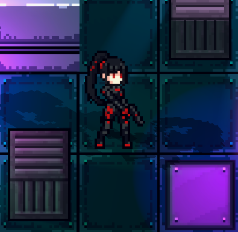
  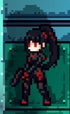

### 오브젝트 광원과 노멀맵

엘리베이터와 상자 같은 오브젝트에도 광원 반응과 표면 입체감이 자연스럽게 드러나도록 노멀맵을 개선했습니다.

  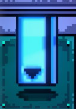
  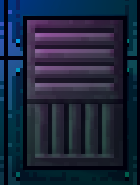

## 제작 과정 및 게임플레이 스크린샷

### 총알 선택 UI

| 일반 탄 | 위치변환 탄 | 원격 이동 탄 |
|---------|-------------|--------------|
| 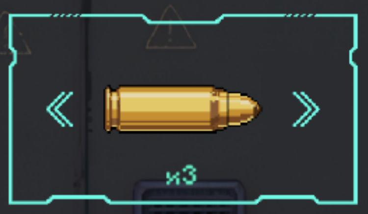 | 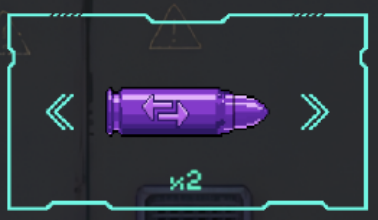 | 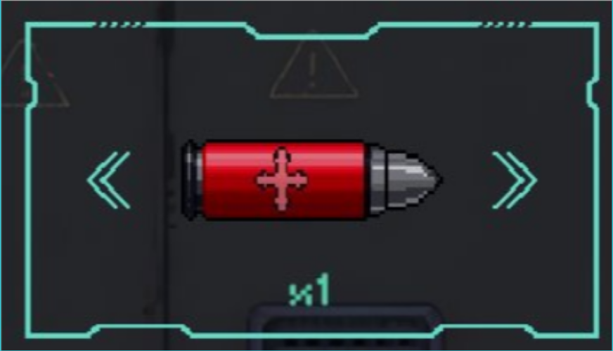 |

### 조준 모드

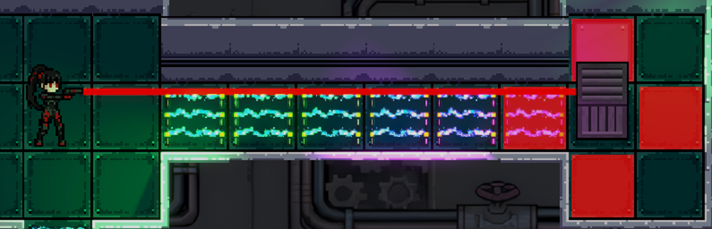

## 게임 소개

어둡고 퇴폐적인 사이버펑크 도시를 배경으로, 플레이어는 총을 이용해 상자를 조종하며 퍼즐을 풀어나갑니다.
기존 소코반에 총알 기믹을 추가해, 총알 종류마다 상자와 적에 다른 효과를 부여하며 전략적인 사고를 요구합니다.

---

## 총알 종류

| 총알 | 색상 | 효과 |
|------|------|------|
| 일반 탄 | 노란색 | 나무 상자를 파괴, 철제 상자에는 효과 없음 |
| 위치변환 탄 | 보라색 | 맞춘 상자와 플레이어의 위치를 교환 |
| 원격 이동 탄 | 빨간색 | 맞춘 상자 또는 적을 선택한 방향으로 한 칸 이동 |

---

## 조작키

| 키 | 동작 |
|----|------|
| 방향키 | 플레이어 이동 |
| Z | 조준 모드 진입 / 총알 발사 |
| 방향키 (조준 모드) | 조준 방향 변경 |
| A / D (조준 모드) | 총알 종류 변경 |
| X | 조준 해제 |
| Q | Undo |
| Space | 한 턴 대기 |
| 방향키 / W·A·S·D (원격 이동) | 대상 이동 방향 선택 |
| Tab | 총알 목록 넣기 / 빼기 |
| E | 튜토리얼 설명창 넣기 / 빼기 |
| Esc | 일시정지 메뉴 |

---

## 주요 기술

- 복합 상태를 복원하는 커맨드 패턴 기반 Undo — 이동·대기·상자 밀기·발사 명령을 공통 인터페이스로 기록하고, 탄약 소비, 투사체, 상자 파괴, 위치 교환, 원격 이동, 적의 턴까지 역순으로 복원
- 인터페이스 기반 턴 시스템 — `ITurnActor`를 통해 플레이어 행동 이후 적의 행동을 동기화하고, 각 액터의 상태 기록을 이용해 턴 단위 Undo 지원
- 확장 가능한 투사체 상호작용 구조 — `IDamageable`, `IProjectileDisplaceable` 인터페이스와 효과별 투사체 로직을 이용해 파괴·위치 교환·끌어오기·방향 선택 이동 구현
- 게임 상태 머신 기반 입력 제어 — 인트로, 플레이, 조준, 대상 선택, 일시정지, 스테이지 클리어, 사망 상태를 분리해 입력과 UI 동작 충돌 방지
- URP 2D 다중 광원 투영 그림자 — 주변 `Light2D`의 거리와 세기를 계산해 스프라이트 메시를 광원 반대 방향으로 투영하고, 타일맵 영역 단위 클리핑으로 그림자 범위 제어
- 노멀맵과 커스텀 셰이더 기반 2D 라이팅 — Secondary Sprite Texture 노멀맵과 ShaderLab/HLSL 셰이더를 활용해 캐릭터와 오브젝트의 광원 반응 및 표면 입체감 구현

---

## 기술 스택

| 항목 | 내용 |
|------|------|
| 엔진 | Unity 6 (6000.3.3f1) URP |
| 언어 | C#, ShaderLab, HLSL |
| 버전 관리 | Unity Version Control (Plastic SCM) |
| AI 도구 | Gemini, OpenAI Codex |

---

## 팀원 및 역할

| 이름 | 역할 |
|------|------|
| 안태우 | 총알 로직 구현, URP 2D 광원·노멀맵·셰이더, 픽셀아트 |
| 허은빈 | UI 구현, 픽셀아트, 사운드 |
| 심정환 | 픽셀아트, 맵 제작, 기본 이동, Undo 로직 구현 |

---

## 버전 관리

본 프로젝트는 Unity Version Control (Plastic SCM)을 통해 팀 협업 및 브랜치 관리를 진행했습니다.
크래프톤 정글 랩 지원을 위해 GitHub에는 최신 소스코드와 Windows 데모 빌드를 공개했으며, 전체 개발 히스토리는 Unity Cloud에서 관리했습니다.

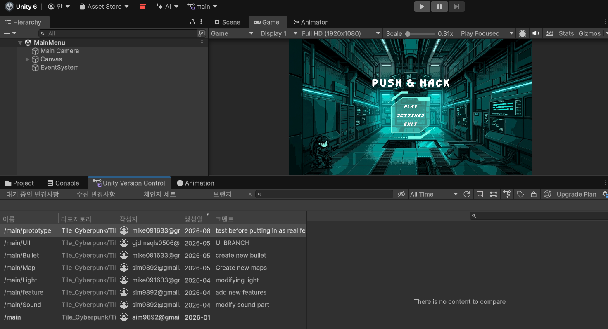

브랜치 구조:

- /main/Bullet — 총알 기믹 구현
- /main/UI — UI 작업
- /main/Map — 맵 제작
- /main/Light — 조명 작업
- /main/Sound — 사운드
- /main/feature — 기능 추가
- /main/prototype — 프로토타입 테스트

---

## 실행 방법

Windows x64 데모는 [GitHub Releases](https://github.com/itsfrankocean/Push_and_Hack/releases/tag/v0.1.0-demo)에서 다운로드할 수 있습니다.

1. `PushAndHack-Windows-x64-Levels1-5.zip` 파일을 다운로드합니다.
2. ZIP 파일 전체를 원하는 폴더에 압축 해제합니다.
3. `PushAndHack.exe`를 실행합니다.

Unity 프로젝트를 직접 열려면 Unity `6000.3.3f1` 버전을 사용해 주세요.
